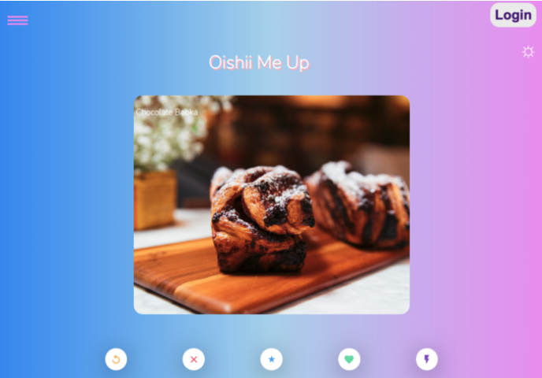
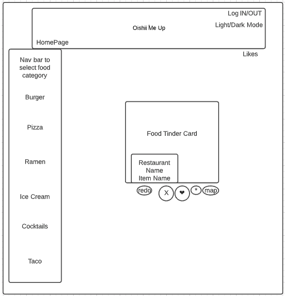
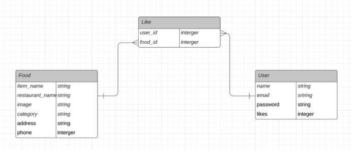

# Phase-3-Project-Frontend

# Description

A food tinder app called Oishii Me Up where a user can swipe left or right on a specific food category.

- “Liked” food is persisted to a favorite list where the user can get the restaurant’s name, restaurant’s address, and make a phone call with each food item.
- User can go back to previous photo using the repeat button.
- User can swipe right using the X button.
- User can swipe left for the food they like using the O button.
- User has navigation bar to look for food based on category.
- App includes a light and dark mode.

# Project Wireframe

# Entity Relationship Map

